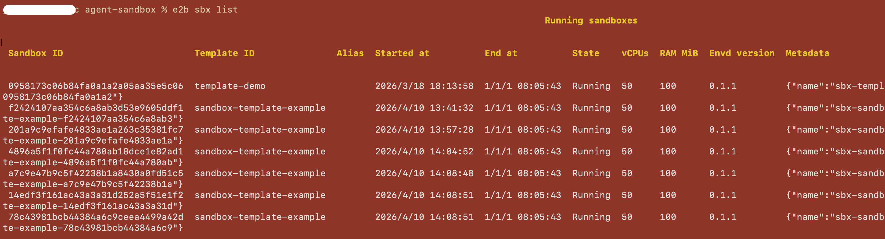

# E2B CLI 兼容指南

本文档描述 E2B CLI 的使用方式，确保与本环境中验证的 CLI 行为兼容。

## 安装

使用 E2B CLI 官方文档的安装说明：

- https://e2b.dev/docs/cli

安装后，验证 CLI 是否可用：

```bash
e2b --version
e2b --help
```

## 认证

在操作沙箱前进行认证：

```bash
export E2B_API_KEY=sys-2492a85b10ed4cb083b2c76b181eac96
export E2B_API_URL=https://your.domain/e2b/v1
```

## 列出沙箱

列出运行中的沙箱（默认行为）：

```bash
e2b sandbox list

# JSON 输出
e2b sandbox list --format json
```


## 创建沙箱

创建沙箱并将终端连接到它：

```bash
# 使用默认模版
e2b sandbox create

# 指定模版
e2b sandbox create code-interpreter
```

## 连接沙箱

通过 ID 连接到已有的运行中沙箱：

```bash
e2b sandbox connect <sandboxID>
```

示例：

```bash
e2b sandbox connect sbx_1234567890
```

## 在沙箱中执行命令

在运行中的沙箱内执行命令：

```bash
e2b sandbox exec <sandboxID> <command...>
```

示例：

```bash
# 基本命令
e2b sandbox exec sbx_1234567890 ls -la

# 设置工作目录
e2b sandbox exec --cwd /home/user sbx_1234567890 pwd

# 以特定用户运行
e2b sandbox exec --user root sbx_1234567890 whoami

# 传递环境变量（可重复）
e2b sandbox exec -e FOO=bar -e HELLO=world sbx_1234567890 env

# 后台运行
e2b sandbox exec --background sbx_1234567890 python -m http.server 8080
```