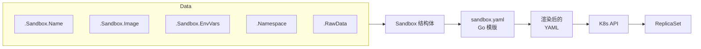
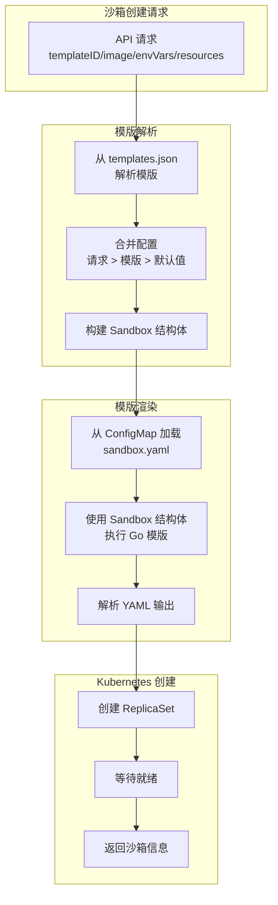

# 沙箱模版

Agent-Sandbox 不直接创建 Pod。相反，它使用 Go 模版（`sandbox.yaml`）为每个沙箱动态生成 Kubernetes ReplicaSet。这个模版称为 **沙箱模版（sandbox-template）**。

与[模版](#)定义（来自 `templates.json`）配合，沙箱模版生成具体的沙箱 ReplicaSet：

```
沙箱模版 (sandbox.yaml) + 模版 (templates.json 条目) = K8s ReplicaSet
```

## 为什么使用 ReplicaSet

使用 ReplicaSet 而非裸 Pod 给 Agent-Sandbox 带来以下优势：

- **轻量级**：无需安装重型 CRD，使用 Kubernetes 内置资源和控制器，易于理解和调试，重要的是完全满足沙箱生命周期管理需求。
- **自愈能力**：如果沙箱 Pod 意外终止，ReplicaSet 会自动重建它
- **声明式状态**：沙箱的完整配置存储在 ReplicaSet 注解中
- **可扩展性**：用户可以自定义沙箱模版添加卷、边车容器或节点调度

### 未来规划
- **HPA 兼容**：ReplicaSet 广泛支持 Kubernetes 特性和工具，如 Horizontal Pod Autoscaler 等。
- **多副本**：我们可以支持多副本沙箱，用于分布式工作负载或高可用场景。

---

## 工作原理

当沙箱创建请求到达时：

1. 控制器解析模版，合并配置，构建 `Sandbox` 结构体
2. `Sandbox` 结构体传入沙箱模版 Go 模版
3. 渲染输出被解析为 Kubernetes ReplicaSet YAML
4. ReplicaSet 在目标命名空间中创建





---

## 模版结构

沙箱模版是标准的 Kubernetes ReplicaSet YAML，包含 Go 模版变量。以下是带注释的默认模版：

```yaml
apiVersion: apps/v1
kind: ReplicaSet
metadata:
  name: {{.Sandbox.Name}}          # 沙箱名称，如 sbx-code-interpreter-abc123
  namespace: {{.Namespace}}         # 目标命名空间
  annotations:
    sandbox-data:  |
      {{.RawData}}                  # JSON 序列化的 Sandbox 结构体
  labels:
    owner: agent-sandbox
    sandbox: {{.Sandbox.Name}}
    sbx-id: {{.Sandbox.ID}}         # 唯一 ID（无连字符的 UUID）
    sbx-user: {{.Sandbox.User}}     # API 密钥 / 用户标识符
    sbx-template: {{.Sandbox.Template}}  # 模版名称
    sbx-pool: {{.Sandbox.IsPool}}   # 池沙箱为 "true"
spec:
  replicas: 1
  selector:
    matchLabels:
      sandbox: {{.Sandbox.Name}}
  template:
    metadata:
      labels:
        sandbox: {{.Sandbox.Name}}
        owner: agent-sandbox
        sbx-id: {{.Sandbox.ID}}
        sbx-user: {{.Sandbox.User}}
        sbx-template: {{.Sandbox.Template}}
        sbx-pool: {{.Sandbox.IsPool}}
    spec:
      containers:
        - name: sandbox
          image: {{.Sandbox.Image}}   # 解析后的容器镜像
          command: [{{.Sandbox.Cmd}}]  # 可选：覆盖 CMD
          args:                        # 可选：容器参数
            {{range .Sandbox.Args}}
            - {{ . }}
            {{end}}
          ports:
            - containerPort: {{.Sandbox.Port}}
          env:
            - name: INSTANCE_NAME
              valueFrom:
                fieldRef:
                  fieldPath: metadata.name
            {{range $name, $value := .Sandbox.EnvVars}}
            - name: {{$name}}
              value: {{printf "%q" $value}}
            {{end}}
          resources:
            requests:
              cpu: {{.Sandbox.CPU}}
              memory: {{.Sandbox.Memory}}
            limits:
              cpu: {{.Sandbox.CPULimit}}
              memory: {{.Sandbox.MemoryLimit}}
          startupProbe:               # 可选：由模版的 noStartupProbe 控制
            failureThreshold: 600
            tcpSocket:
              port: {{.Sandbox.Port}}
            periodSeconds: 1
```

---

## 模版变量

沙箱模版接收 `SandboxKube` 结构体：

```go
type SandboxKube struct {
    Sandbox   *Sandbox
    RawData   string    // JSON 序列化的 Sandbox 结构体
    Namespace string    // 目标 Kubernetes 命名空间
}
```

### Sandbox 字段

| 变量 | 类型 | 描述 |
|----------|------|-------------|
| `.Namespace` | string | Kubernetes 命名空间 |
| `.Sandbox.Name` | string | 生成的沙箱名称（如 `sbx-code-interpreter-abc123`） |
| `.Sandbox.ID` | string | 唯一 ID（无连字符的 UUID） |
| `.RawData` | string | JSON 序列化的沙箱，用于注解存储 |
| `.Sandbox.User` | string | API 密钥或用户标识符 |
| `.Sandbox.Template` | string | 模版名称 |
| `.Sandbox.Image` | string | 解析后的容器镜像 |
| `.Sandbox.Port` | int | 服务端口（默认：8080） |
| `.Sandbox.Cmd` | string | 容器命令覆盖 |
| `.Sandbox.Args` | []string | 容器参数 |
| `.Sandbox.EnvVars` | map[string]string | 请求中的环境变量 |
| `.Sandbox.CPU` | string | CPU 请求 |
| `.Sandbox.Memory` | string | 内存请求 |
| `.Sandbox.CPULimit` | string | CPU 限制 |
| `.Sandbox.MemoryLimit` | string | 内存限制 |
| `.Sandbox.IsPool` | bool | 是否为池 ReplicaSet |

完整字段列表可在代码库的 `pkg/sandbox/sandbox.go` 结构体定义中找到。

### 条件块

模版支持 Go 条件和循环：

```yaml
{{if .Sandbox.Cmd}}
command: [{{.Sandbox.Cmd}}]
{{end}}

{{if .Sandbox.Args}}
args:
{{range .Sandbox.Args}}
  - {{ . }}
{{end}}
{{end}}

{{if .Sandbox.EnvVars}}
{{range $name, $value := .Sandbox.EnvVars}}
- name: {{$name}}
  value: {{printf "%q" $value}}
{{end}}
{{end}}

{{if not .Sandbox.TemplateObj.NoStartupProbe}}
startupProbe:
  ...
{{end}}
```

---

## 热重载

沙箱模版存储在 ConfigMap 中，与模版定义并存：

| ConfigMap 键 | 内容 |
|---------------|---------|
| `config-sandbox-template` | ReplicaSet YAML 的 Go 模版 |
| `config-templates` | 模版定义的 JSON 数组 |

控制器监视 ConfigMap，在变更时重新加载沙箱模版——无需重启。

---

## API 端点

通过 REST API 管理沙箱模版：

```
GET  /api/v1/config/sandbox-template   # 获取当前沙箱模版
POST /api/v1/config/sandbox-template   # 更新沙箱模版
```

也支持在 UI 中管理模版。

---

## 自定义

你可以修改沙箱模版以适配你的基础设施：

### 卷

**NAS：**
```yaml
spec:
  containers:
    - name: sandbox
      volumeMounts:
        - mountPath: /data/
          name: sb-data
  volumes:
    - name: sb-data
      nfs:
        path: /data/
        server: nas.ip
```

### 节点调度

```yaml
spec:
  nodeSelector:
    xxx/instance-type: xxx-node
  tolerations:
    - effect: NoSchedule
      key: xxx/instance-type
      operator: Equal
      value: xxx-node
```

### 私有镜像仓库

```yaml
spec:
  imagePullSecrets:
    - name: regsecret-enterprise
```

### 边车容器

添加额外的容器用于日志、指标或 CSI 支持：

```yaml
spec:
  initContainers:
    - name: sidecar
      restartPolicy: Always # 边车长期运行，不仅仅是初始化，k8s 1.28+ 版本支持 initContainers 使用 restartPolicy Always
      ...
  containers:
    - name: sandbox
      ...
```