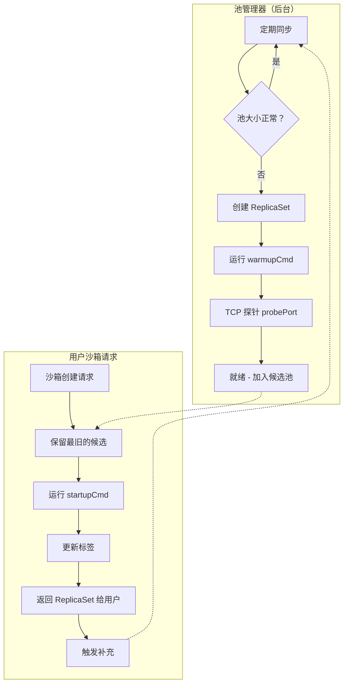
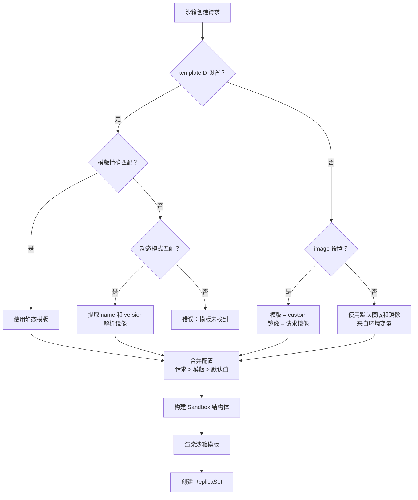

# 模版

模版定义 Agent-Sandbox 中可用的沙箱类型。每个模版指定容器镜像、资源和可选的池配置。

与[沙箱模版](sandbox-template.md)配合，模版生成具体的 Kubernetes ReplicaSet：

```
沙箱模版 (sandbox.yaml) + 模版 (templates.json 条目) = K8s ReplicaSet
```

---

## 模版类型

### 静态模版

静态模版使用固定的容器镜像：

```json
{
  "name": "code-interpreter",
  "image": "ghcr.io/agent-sandbox/code-interpreter:0.4.0",
  "port": 49999,
  "resources": {
    "cpu": "0.2",
    "memory": "200Mi",
    "cpuLimit": "1",
    "memoryLimit": "1Gi"
  },
  "description": "E2B 兼容的代码解释器环境"
}
```

当你有已知的稳定镜像时使用静态模版。

### 动态模版

动态模版允许你为**一组镜像定义一个模版**，而不是为每个镜像版本创建单独的模版。

#### 为什么使用动态模版？

E2B API 和 SDK 不支持在创建沙箱时直接指定容器镜像。你必须传递引用预定义模版的 `templateID`。这带来了一个问题：**如果你在某个场景下有许多镜像变体（不同名称、版本）**，你需要为每一个定义一个模版。

动态模版通过将镜像名称和版本嵌入 `templateID` 来解决这个问题。控制器通过正则模式匹配提取它们，因此你可以：

- **避免预注册**：无需提前为每个镜像版本定义模版
- **通过 templateID 指定任意镜像**：传递匹配模式的 `templateID`，镜像自动解析
- **一个模式覆盖所有**：单个模版定义可处理无限镜像变体

#### 示例

```json
{
  "name": "faas-code",
  "pattern": "faas-code-(?P<name>.+)\\.(?P<version>.+)$",
  "image": "ghcr.io/agent-sandbox/<name>:<version>",
  "type": "dynamic",
  "port": 49999,
  "description": "适用于任意运行时的动态代码解释器"
}
```

使用 E2B SDK：

```python
# 创建使用 python 3.11 运行时的沙箱
sandbox = Sandbox.create(templateID="faas-code-python.3.11")

# 创建使用 nodejs 18 运行时的沙箱
sandbox = Sandbox.create(templateID="faas-code-nodejs.18")

# 创建使用 go 1.21 运行时的沙箱
sandbox = Sandbox.create(templateID="faas-code-golang.1.21")
```

所有这些请求匹配同一个动态模版。模式提取 `name` 和 `version`，生成：

| templateID | name | version | 解析的镜像 |
|------------|------|---------|----------------|
| `faas-code-python.3.11` | python | 3.11 | `ghcr.io/agent-sandbox/python:3.11` |
| `faas-code-nodejs.18` | nodejs | 18 | `ghcr.io/agent-sandbox/nodejs:18` |
| `faas-code-golang.1.21` | golang | 1.21 | `ghcr.io/agent-sandbox/golang:1.21` |

#### 模式要求

- 必须包含 `(?P<name>...)` 捕获组用于镜像名称
- 必须包含 `(?P<version>...)` 捕获组用于镜像版本/标签
- `image` 字段使用 `<name>` 和 `<version>` 作为占位符

当你有一组遵循一致命名模式的镜像时，使用动态模版。

---

## 模版字段

| 字段 | 类型 | 必填 | 描述 |
|-------|------|----------|-------------|
| `name` | string | 是 | 模版标识符（在 API 中用作 `templateID`） |
| `image` | string | 是* | 容器镜像。动态模版使用 `<name>` 和 `<version>` 占位符 |
| `pattern` | string | 否 | 动态模版的正则模式。必须包含 `(?P<name>...)` 和 `(?P<version>...)` 捕获组 |
| `type` | string | 否 | 设置为 `"dynamic"` 启用模式匹配 |
| `port` | int | 否 | 主服务端口（默认：8080） |
| `description` | string | 是 | 人类可读的描述 |
| `resources` | object | 否 | CPU/内存请求和限制 |
| `pool` | object | 否 | 预热沙箱的池配置 |
| `noStartupProbe` | bool | 否 | 在沙箱模版中禁用 TCP 启动探针 |
| `args` | array | 否 | 默认容器参数 |
| `metadata` | object | 否 | 合并到沙箱元数据的自定义键值对 |

\* `image` 对静态模版必填。动态模版从模式解析镜像。

---

### 资源

为沙箱容器定义 CPU 和内存：

```json
{
  "resources": {
    "cpu": "0.2",
    "memory": "200Mi",
    "cpuLimit": "1",
    "memoryLimit": "1Gi"
  }
}
```

| 字段 | 描述 |
|-------|-------------|
| `cpu` | CPU 请求（如 `"0.2"` = 200m） |
| `memory` | 内存请求（如 `"200Mi"`） |
| `cpuLimit` | CPU 限制（如 `"1"` = 1000m） |
| `memoryLimit` | 内存限制（如 `"1Gi"`） |

这些值成为从该模版创建的沙箱的默认值。API 请求可以覆盖它们。

---

## 池配置

模版可以定义池，预创建预热沙箱以实现即时分配。

### 两阶段启动

Agent-Sandbox 池的创新之处在于使用 `warmupCmd` 和 `startupCmd` 的**两阶段启动**设计，平衡快速启动时间与低资源开销。

与其他池实现不同：

- **完全预启动所有内容**：分配快但空闲资源成本高

Agent-Sandbox 将初始化分为两个阶段：

| 阶段 | 命令 | 时机 | 目的 | 资源影响 |
|-------|---------|------|---------|-----------------|
| **预热** | `warmupCmd` | 池创建时（一次） | 启动轻量进程、预加载依赖 | 低 CPU/内存 |
| **启动** | `startupCmd` | 用户获取时（每次） | 启动面向用户的服务 | 需要完整资源 |

#### 示例：E2B Code Interpreter

```json
{
  "name": "code-interpreter",
  "pool": {
    "size": 3,
    "probePort": 8888,
    "warmupCmd": "/root/.server/warmup.sh",
    "startupCmd": "/root/.server/startup.sh",
    "resources": {
      "cpu": "0",
      "memory": "60Mi",
      "cpuLimit": "0.2",
      "memoryLimit": "100Mi"
    }
  }
}
```

**warmup.sh** 启动 Jupyter 内核（轻量，约 50Mi 内存，接近零 CPU）：

```bash
#!/bin/bash
# 以预热模式启动 Jupyter - 就绪但未提供服务
jupyter kernel --kernel-name=python3 --WarmupMode=true
```

**startup.sh** 在用户获取沙箱时启动 envd 并连接运行时：

```bash
#!/bin/bash
# 启动 envd 服务并连接 Python 运行时
envd start --port 49999
jupyter connect
```

**结果：**

| 指标 | 值 |
|--------|-------|
| 沙箱创建时间 | **< 1 秒** |
| 空闲池 CPU | **0 (0m)** |
| 空闲池内存 | **约 57 Mi** |

这种设计使得在最小成本下维护大量预热沙箱池成为可能，同时仍在用户请求沙箱时提供亚秒级分配。

### 池字段

```json
{
  "pool": {
    "size": 3,
    "probePort": 8888,
    "warmupCmd": "/root/.server/warmup.sh",
    "startupCmd": "/root/.server/startup.sh",
    "resources": {
      "cpu": "0",
      "memory": "60Mi",
      "cpuLimit": "0.2",
      "memoryLimit": "100Mi"
    }
  }
}
```

| 字段 | 描述 |
|-------|-------------|
| `size` | 维护的预热沙箱数量 |
| `probePort` | 池创建期间 TCP 启动探针的端口 |
| `warmupCmd` | 池初始化期间运行的命令。格式：`command,arg1 arg2`（逗号分隔） |
| `startupCmd` | 将池适配为用户沙箱时运行的命令 |
| `resources` | 池容器的资源设置（通常低于生产环境） |

### 池生命周期

1. **补充**：池管理器定期创建 ReplicaSet 以维持 `size`
2. **预热**：每个池 ReplicaSet 运行 `warmupCmd`（如以预热模式启动 Jupyter）
3. **就绪状态**：`probePort` 上的 TCP 探针确认就绪
4. **获取**：收到沙箱请求时，保留最旧的就绪 ReplicaSet
5. **启动**：`startupCmd` 启动面向用户的服务（如 envd、运行时连接）
6. **适配**：更新标签（`sbx-pool=false`、`sbx-user=...`）
7. **返回**：适配后的 ReplicaSet 返回给用户



---

## 工作原理

当你使用 `templateID` 创建沙箱时：



### 1. 精确匹配（静态）

```json
// templates.json
{"name": "code-interpreter", "image": "ghcr.io/agent-sandbox/code-interpreter:0.4.0", ...}
```

```
templateID=code-interpreter → 精确匹配 → 镜像解析
```

### 2. 模式匹配（动态）

```json
// templates.json
{"name": "code-interpreter-biz", "type": "dynamic", "pattern": "faas-code-(?P<name>.+)\\.(?P<version>.+)$", ...}
```

```
templateID=faas-code-python.3.11 → 模式匹配 → image=ghcr.io/agent-sandbox/python:3.11
```

### 3. 无模版（自定义镜像）

如果未设置 `templateID` 但提供了 `image`：

```
image=ghcr.io/my-org/my-image:latest → 模版名称变为 "custom"
```

### 4. 默认

如果 `templateID` 和 `image` 都未设置：

```
→ 使用环境变量中的 SANDBOX_DEFAULT_TEMPLATE 和 SANDBOX_DEFAULT_IMAGE
```

---

### 配置合并

创建沙箱时，配置按以下优先级合并（高优先级优先）：

1. **API 请求参数**：来自 `POST /e2b/v1/sandboxes` 或 `POST /api/v1/sandbox` 的值
2. **模版默认值**：来自 `templates.json` 中匹配模版的值
3. **全局默认值**：控制器中的硬编码后备值

示例：如果请求指定 `cpu: "500m"` 但模版定义 `cpu: "200m"`，使用请求值（`500m`）。

---

## 热重载

模版存储在 ConfigMap 中：

| ConfigMap 键 | 内容 |
|---------------|---------|
| `config-templates` | 模版定义的 JSON 数组 |

控制器监视 ConfigMap，在变更时重新加载模版——无需重启。

### 初始加载

首次启动时，如果 ConfigMap 为空，控制器从 `config/templates.json`（或 `SANDBOX_TEMPLATES_CONFIG_FILE`）加载并保存到 ConfigMap。

---

### API 端点

通过 REST API 管理模版：

```
GET  /api/v1/config/templates    # 列出所有模版
POST /api/v1/config/templates    # 更新模版（完全替换）
```

模版也可以在 Web UI 中管理。

---

## 模版定义示例

### 最简模版

```json
{
  "name": "python",
  "image": "python:3.11-slim",
  "description": "Python 3.11 环境"
}
```

### 完整模版（含池）

```json
{
  "name": "code-interpreter",
  "image": "ghcr.io/agent-sandbox/code-interpreter:0.4.0",
  "port": 49999,
  "resources": {
    "cpu": "0.2",
    "memory": "200Mi",
    "cpuLimit": "1",
    "memoryLimit": "1Gi"
  },
  "pool": {
    "size": 3,
    "probePort": 8888,
    "warmupCmd": "/root/.server/warmup.sh",
    "startupCmd": "/root/.server/startup.sh",
    "resources": {
      "cpu": "0",
      "memory": "60Mi",
      "cpuLimit": "0.2",
      "memoryLimit": "100Mi"
    }
  },
  "noStartupProbe": false,
  "description": "E2B 兼容的代码解释器环境"
}
```

### 动态模版

```json
{
  "name": "runtime",
  "pattern": "^(?P<name>[a-z]+)-(?P<version>[0-9.]+)$",
  "image": "ghcr.io/runtimes/<name>:<version>",
  "type": "dynamic",
  "port": 8080,
  "description": "版本化环境的通用运行时模版"
}
```

---

## 最佳实践

### 命名

- 使用小写、连字符分隔的名称：`code-interpreter`、`nodejs-runtime`
- 保持名称简短但具有描述性

### 资源

- 将 `cpu` 和 `memory` 设置为典型使用量，而非最大值
- 将限制设置为请求的 2-5 倍以获得突发能力
- 使用较低的 `pool.resources` 以节省预热沙箱成本

### 池

- 仅对频繁使用的模版启用池
- 根据预期并发使用量确定池大小
- 使用 `warmupCmd` 处理慢初始化（包安装、模型下载）
- 使用 `startupCmd` 处理快速服务启动

### 动态模版

- 保持模式具体以避免意外匹配
- 始终包含 `(?P<name>...)` 和 `(?P<version>...)` 捕获组
- 在部署前用预期的模版 ID 测试模式